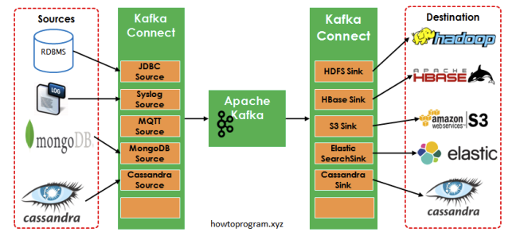
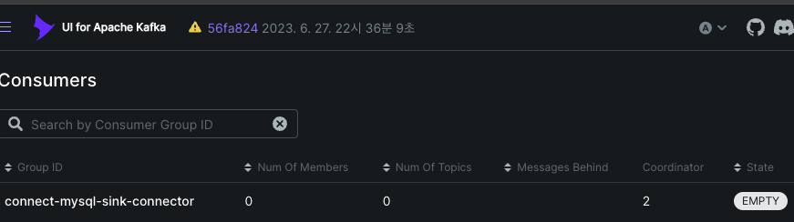
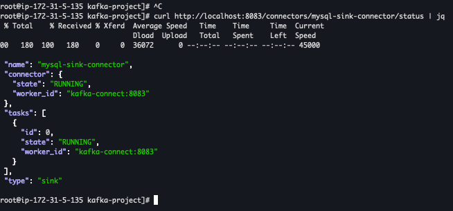

# Kafka Connect + MirrorMaker

- [x] kafka
- [x] kafka-ui
- [x] mysql
- [ ] kafka-connect - connector
- [ ] kafka-connect - sink

[source-code](./docker-compose.infra.yml)

## Kafka Connect



- 손쉽게 Kafka Pipeline을 구성 (producer, consumer 역할)
- Source, Target을 모두 지원
- dev : standalone, prod : cluster ( 고가용성 / 부하분산 )

### Connector 구성요소

- Connector

  - 데이터 소스와 Kafak Cluster 간에 데이터를 이동시키는 일련의 작업
  - <b>producer -> Source Connector</b>
  - <b>consumer -> Sink Connector</b>

- Task

  - 각 Connector는 하나이상의 작업을 가질 수 있다
  - 데이터를 이동시키는 단위
  - 병렬로 실행 됨 (Task는 여러개임...)
  - 빠르게 실행해야 한다면 -> Task 수를 여러개 늘림 (조절)

- Converter

  - 데이터를 직렬화 / 역직렬화 함
  - Avro, JSON, Protobuf

- Rest API

  - REST API 제공
  - Connector를 동적으로 추가하거나 수정할 수 있음

### Kafka To RDB

- Kafka MYSQL Sink Connector 연결




```sh
# Source Connector 등록
curl -X POST http://localhost:8083/connectors \
  -H "Content-Type: application/json" \
  -d @kafka-connect/mysql-source-config.json

# Sink Connector 등록
curl -X POST http://localhost:8083/connectors \
  -H "Content-Type: application/json" \
  -d @kafka-connect/mysql-sink-config.json

# Connector 상태 확인
curl http://localhost:8083/connectors/mysql-sink-connector/status

# 등록된 Connector 목록 확인
curl http://localhost:8083/connectors
```

### Kafka To S3

## MirrorMaker
