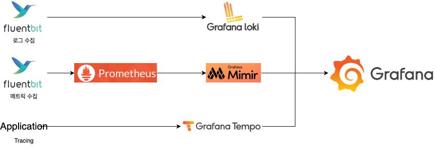

# Content-Delivery

- [x] API
- [x] Kafka
- [x] Consumer Server
- [x] Database
- [x] fluentbit
- [x] prometheus
- [x] loki
- [ ] tempo
- [x] grafana
- [ ] grafana -> metric dashboard
- [ ] grafana -> trace dashboard
- [ ] grafana -> log dashboard

## Docker-Compose

- [docker-compose.yml](./docker-compose.yml) api 서버
- [docker-compose.kafka.yml](./docker-compose.kafka.yml) kafka + ui
- [docker-compose.log.yml](./docker-compose.log.yml) prometheus + loki + grafana + open telemetry

# Huge Traffic Architecture Use Kafka

- 대용량에 트래픽이 발생하게 될때 -> <b>DB 모든 부하가 발생함</b>
- DB 자체에 장애가 발생한다면 모든시스템에 장애가 발생할 수 있음 (SPOF)

## LGTM Stack

### 로그수집

- fluentbit + loki

### 메트릭 수집

- fluentbit + prometheus + mimir

### 분산 Tracing

- application + tempo

## 참고

- <a href="https://medium.com/@dudwls96/opentelemetry-grafana-loki-tempo-prometheus%EB%A5%BC-%ED%99%9C%EC%9A%A9%ED%95%9C-golang-observability-%EA%B5%AC%EC%84%B1%ED%95%98%EA%B8%B0-3cf148039c1c"> Golang Tempo 구성하기 </a>

- <a href="https://nyyang.tistory.com/175"> LGTM Stack 구성하기 </a>
