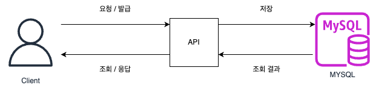
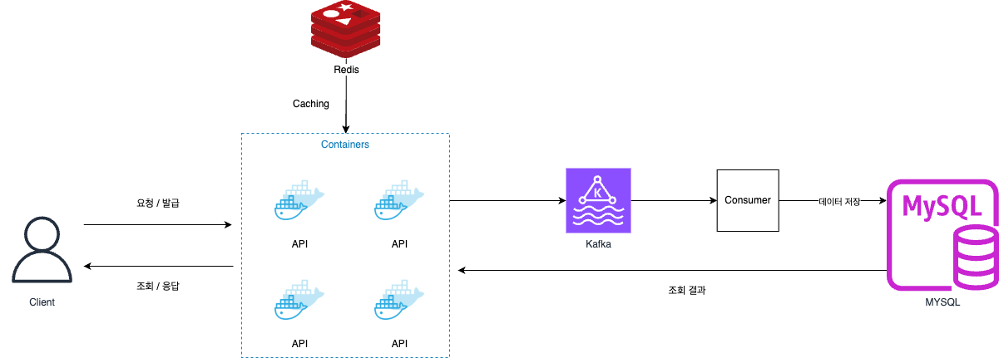

# Content-Delivery

- [x] API
- [x] Kafka
- [x]Consumer Server
- [x] Database

# Huge Traffic Architecture

- 대용량에 트래픽이 발생하게 될때 -> <b>DB 모든 부하가 발생함</b>
- DB 자체에 장애가 발생한다면 모든시스템에 장애가 발생할 수 있음 (SPOF)

